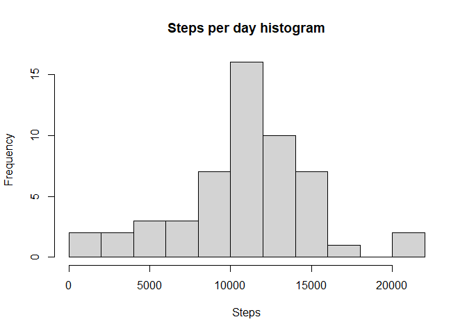
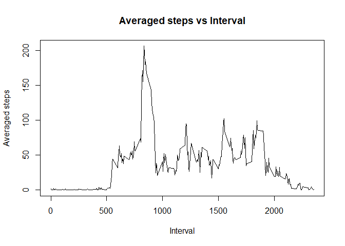
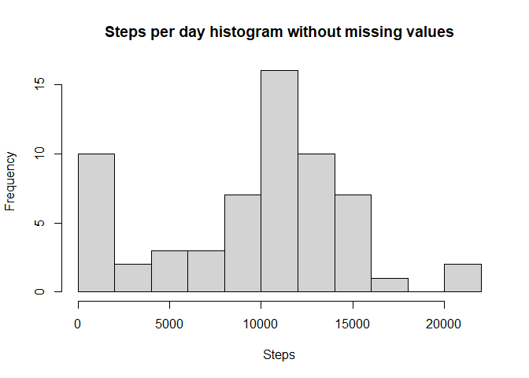
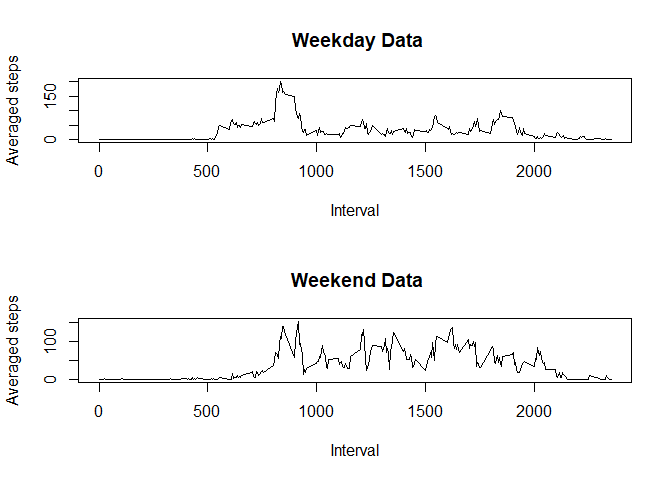

## Loading and preprocessing the data

```r
##Getting the data

url <- "http://d396qusza40orc.cloudfront.net/repdata%2Fdata%2Factivity.zip"
filename <- "repdata_data_activity"

if (!file.exists(filename))
{
  download.file(url, destfile = filename)
}

if (!file.exists("activity.csv"))
{
  unzip(filename)
}

##Reading data
data <- read.csv("activity.csv")
##Transforming dates column to date format
data$date <- as.Date(data$date, "%Y-%m-%d")
```


## What is mean total number of steps taken per day?

```r
##Total Number of steps per day
stepsperday <- aggregate(steps ~ date, data, sum, na.rm = TRUE)

hist(stepsperday$steps, breaks = 10, 
     xlab = "Steps", main = "Steps per day histogram")
```

<!-- -->

```r
dev.copy(png, file = "plot1.png")
```

```
## png 
##   3
```

```r
dev.off()
```

```
## png 
##   2
```

```r
mean_stepsperday <- mean(stepsperday$steps)
median_stepsperday <- median(stepsperday$steps)

mean_stepsperday
```

```
## [1] 10766.19
```

```r
median_stepsperday
```

```
## [1] 10765
```


## What is the average daily activity pattern?

```r
stepsperinterval <- aggregate(steps ~ interval, data, mean)
plot(stepsperinterval$interval, stepsperinterval$steps, type = "l", 
     xlab = "Interval", ylab = "Averaged steps", 
     main = "Averaged steps vs Interval")
```

<!-- -->

```r
maxinterval <- stepsperinterval$interval[which.max(stepsperinterval$steps)]
dev.copy(png, file = "plot2.png")
```

```
## png 
##   3
```

```r
dev.off()
```

```
## png 
##   2
```


## Imputing missing values

```r
##Calculating missing values
missingvalues <- sum(is.na(data$steps))
data_withoutNA <- data

##setting NA steps to 0
data_withoutNA[is.na(data_withoutNA$steps), "steps"] <- 0
stepsperday_withoutNA <- aggregate(steps ~ date, 
                                   data_withoutNA, sum, na.rm = TRUE)

hist(stepsperday_withoutNA$steps, breaks = 10, 
     xlab = "Steps", main = "Steps per day histogram without missing values")
```

<!-- -->

```r
dev.copy(png, file = "plot3.png")
```

```
## png 
##   3
```

```r
dev.off()
```

```
## png 
##   2
```

```r
mean_stepsperday_withoutNA <- mean(stepsperday_withoutNA$steps)
median_stepsperday_withoutNA <- median(stepsperday_withoutNA$steps)

mean_stepsperday_withoutNA
```

```
## [1] 9354.23
```

```r
median_stepsperday_withoutNA
```

```
## [1] 10395
```
Mean and median shifted towards 0 because of the added zero values. 

## Are there differences in activity patterns between weekdays and weekends?

```r
##Panel Plot
data_withoutNA$day <- as.POSIXlt(data_withoutNA$date)$wday
data_withoutNA$dayfactor <- as.factor(ifelse(data_withoutNA$day == 0 |
                                               data_withoutNA$day == 6,
                                             "weekend", "weekday"))
weekend_data <- subset(data_withoutNA, dayfactor == "weekend")
weekday_data <- subset(data_withoutNA, dayfactor == "weekday")

aggr_weekend <- aggregate(steps ~ interval, weekend_data, mean)
aggr_weekday <- aggregate(steps ~ interval, weekday_data, mean)


par(mfrow = c(2,1))
plot(aggr_weekday$interval, aggr_weekday$steps, type = "l", 
     xlab = "Interval", ylab = "Averaged steps", 
     main = " Weekday Data")
plot(aggr_weekend$interval, aggr_weekend$steps, type = "l", 
     xlab = "Interval", ylab = "Averaged steps", 
     main = " Weekend Data")
```

<!-- -->

```r
dev.copy(png, file = "plot4.png")
```

```
## png 
##   3
```

```r
dev.off()
```

```
## png 
##   2
```
